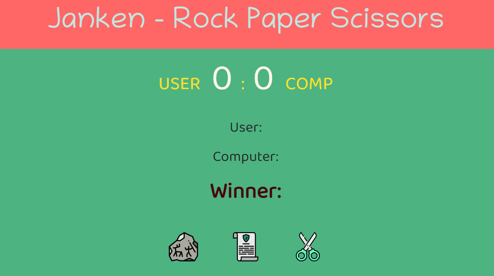

# ⭐ Project - Rock Paper Scissors ⭐
🔗 [Project Link](https://vishal-kumaar.github.io/Rock-Paper-Scissors/ "Click me")  

This is a javascript project given in the **Ineuron's Full Stack JavaScript Development Bootcamp**.

 

## 💻 Tech Stack

    - 👉 HTML
    - 👉 CSS
    - 👉 JavaScript

 

## 📌 What I learn?

    - 👉 HTML, CSS and DOM Manipulation
    - 👉 Learned how to handle Click Event Listener
    - 👉 Learned about Higher order function (forEach) in JavaScript
    - 👉 Learned about Math library in JavaScript

 

## 📸 Screenshot

 

> The time taken to build this project is 2 hours and I really enjoyed it 😎.

 

## 📫 Contect me

[Linkedin](https://www.linkedin.com/in/vishal-kumar-909758228/)  
[Instagram](https://www.instagram.com/_vishal.kumar07/?next=%2F)

## 🙌 Acknowledgements:

I am thankful for **Hitesh Choudhary sir**, **Anurag Tiwari sir**, and **iNeuron team** for this amazing Bootcamp.
